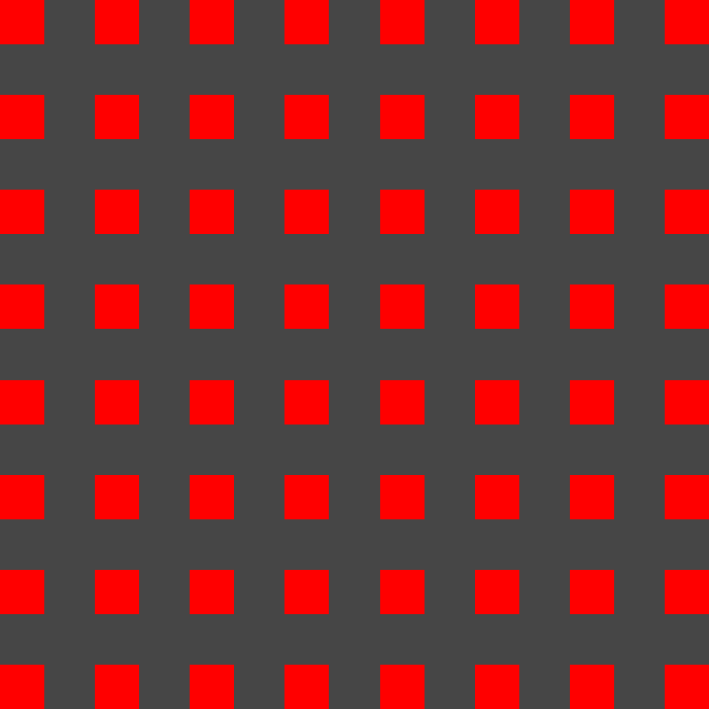
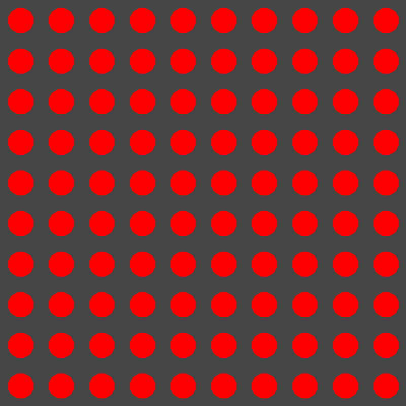

# A Simple library for generating images.


## Features

Pograph is a c++ library for generating .ppm files.
Generating and reading both plain and raw files is supported.
Currently there is support for creating rectangles, circles and custom sprites.
#####Important
Files with comments inside cannot be used to create a sprite.

## Build

### Linux

#### Compiling into a static library

```console
$ git clone github.com/KxUgh/pograph.git
$ cd pograph
$ g++ -c -o pograph.o pograph.cpp
$ ar rcs libpograph.a pograph.o
$ sudo cp pograph.h /usr/local/include/
```
To use the library include `pograph.h` in your application and compile it with the path to the library e.g.

```console
$ g++ my_project.cpp /path/to/pograph/libpograph.a
```


#### Compiling into a shared library

```console
$ git clone github.com/KxUgh/pograph.git
$ cd pograph
$ g++ -fPIC -shared -o libpograph.so pograph.cpp
$ sudo cp pograph.h /usr/local/include/
$ sudo cp pograph.so /usr/local/lib/
```
To use the library include `pograph.h` in your application and compile it with `-lpograph` flag.

## Gallery






